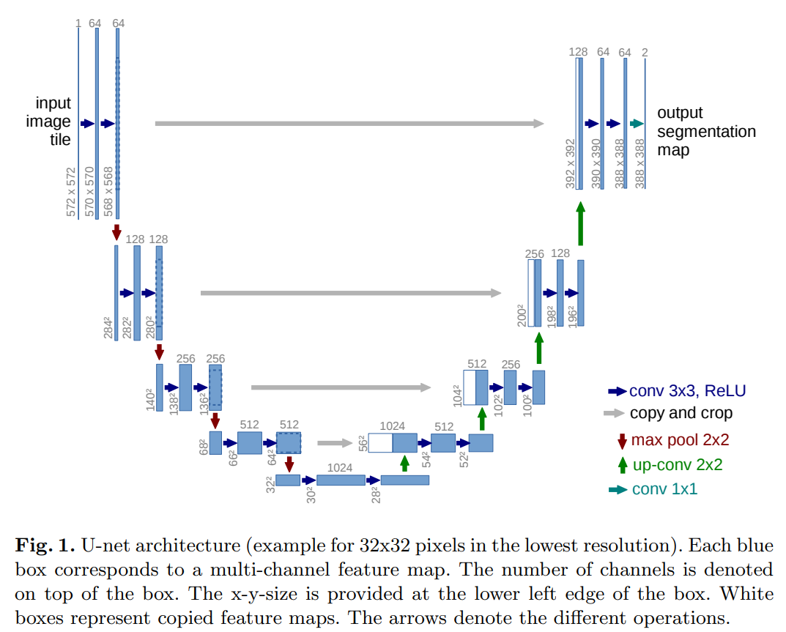
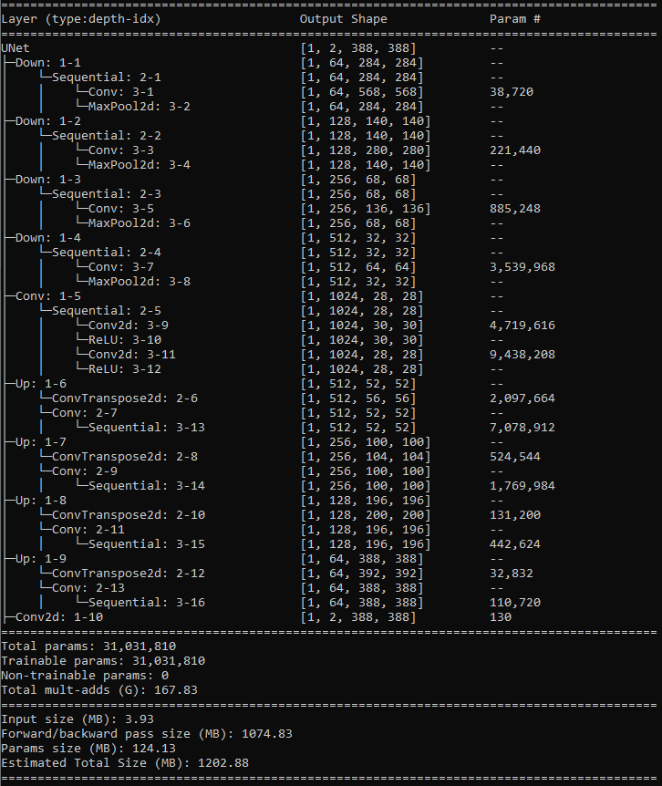

# U-Net-Implementation

"U-Net: Convolutional Networks for Biomedical Image Segmentation" by Olaf Ronneberger, Philipp Fischer and Thomas Brox

Paper: https://arxiv.org/pdf/1505.04597.pdf

## Architecture



## Soon 

GPU POOR !!!

Didn't train cause I don't have a powerful GPU. But the architecture is there for playing.

## Info

Run script below to checkout the model informations.

```sh
python info.py
```



## Usage

Before running the script, place your data directory location for both train and test data in `root_dir="{DIR}"` here at [dataloader.py](./dataloader/dataloader.py)

```sh
python train.py --epochs 100
```

## Citation

```
@misc{ronneberger2015unetconvolutionalnetworksbiomedical,
      title={U-Net: Convolutional Networks for Biomedical Image Segmentation}, 
      author={Olaf Ronneberger and Philipp Fischer and Thomas Brox},
      year={2015},
      eprint={1505.04597},
      archivePrefix={arXiv},
      primaryClass={cs.CV},
      url={https://arxiv.org/abs/1505.04597}, 
}
```
